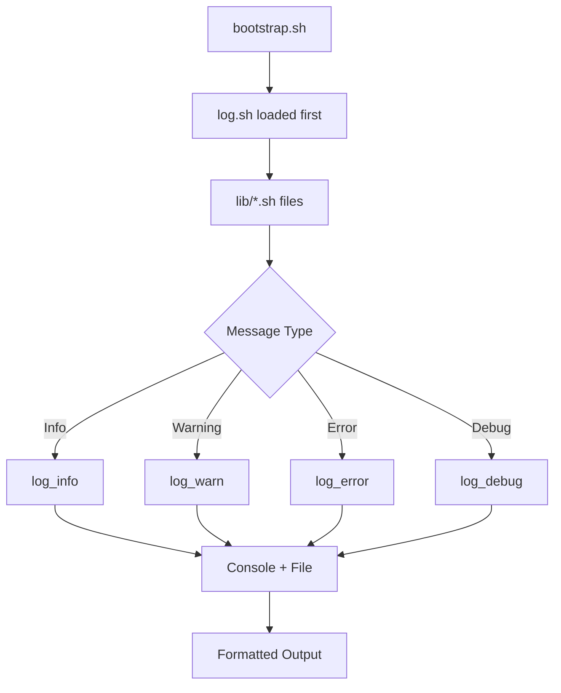

# Logging System Implementation Plan

## Overview

Formalize the logging system with three levels: `info`, `warn`, `error`, plus structured logging records to files. This will make the bootstrap framework more maintainable and provide better debugging capabilities.

## Current State Analysis

The codebase currently uses raw `echo` statements throughout:

| File | Echo Count | Examples |
|------|------------|----------|
| [`bootstrap.sh`](/home/nostal/proj/bootstrap/bootstrap/bootstrap.sh) | ~30 | `"Installing: $mod"`, `"Error: Module not found"` |
| [`lib/core.sh`](/home/nostal/proj/bootstrap/bootstrap/lib/core.sh) | ~20 | `"Loaded module: $module_name"`, `"Error: Module not registered"` |
| [`lib/config.sh`](/home/nostal/proj/bootstrap/bootstrap/lib/config.sh) | ~25 | `"Linked: $target → $source"`, `"Error: Source does not exist"` |
| [`lib/deps.sh`](/home/nostal/proj/bootstrap/bootstrap/lib/deps.sh) | ~10 | `"Error: Circular dependency detected"` |
| [`lib/distro.sh`](/home/nostal/proj/bootstrap/bootstrap/lib/distro.sh) | ~15 | `"Installing packages: $packages"`, `"ERROR: Cannot detect package manager"` |
| [`lib/proof.sh`](/home/nostal/proj/bootstrap/bootstrap/lib/proof.sh) | ~40 | `"[PROOF] ✓ $module verified"`, `"Proof system initialized"` |
| [`lib/state.sh`](/home/nostal/proj/bootstrap/bootstrap/lib/state.sh) | ~5 | JSON state operations |

## Implementation Steps

### Step 1: Create `bootstrap/lib/log.sh`

New logging library with the following functions:

```bash
# Log levels
LOG_LEVEL_INFO=1
LOG_LEVEL_WARN=2
LOG_LEVEL_ERROR=3
LOG_LEVEL_DEBUG=0

# Configuration
LOG_FILE="${BOOTSTRAP_DIR}/logs/bootstrap.log"
LOG_LEVEL="${LOG_LEVEL_INFO}"

# Core functions
log_info()    # Informational messages (green)
log_warn()    # Warning messages (yellow)  
log_error()   # Error messages (red)
log_debug()   # Debug messages (gray, only when VERBOSE=1)

# Log to file with timestamp and level
log_record()  # Structured log entry with timestamp, level, message

# Log file management
log_init()    # Initialize log directory
log_rotate()  # Rotate logs if too large
```

### Step 2: Integrate log.sh into bootstrap.sh

Update [`bootstrap/bootstrap.sh`](/home/nostal/proj/bootstrap/bootstrap/bootstrap.sh) load order:

```bash
# Load core libraries (in order)
source "${BOOTSTRAP_DIR}/lib/log.sh"      # NEW - logging first
source "${BOOTSTRAP_DIR}/lib/config.sh"
source "${BOOTSTRAP_DIR}/lib/proof.sh"
source "${BOOTSTRAP_DIR}/lib/deps.sh"
source "${BOOTSTRAP_DIR}/lib/state.sh"
source "${BOOTSTRAP_DIR}/lib/core.sh"
```

### Step 3: Replace echo in lib files

Replace all `echo` statements with appropriate log functions:

#### [`lib/core.sh`](/home/nostal/proj/bootstrap/bootstrap/lib/core.sh) - ~20 replacements
- `echo "Error: ..."` → `log_error`
- `echo "Loaded module: ..."` → `log_info`
- Module installation messages

#### [`lib/config.sh`](/home/nostal/proj/bootstrap/bootstrap/lib/config.sh) - ~25 replacements
- `echo "Error: ..."` → `log_error`
- `echo "Linked: ..."` → `log_info`
- `echo "Copied: ..."` → `log_info`
- `echo "Backed up: ..."` → `log_info`

#### [`lib/deps.sh`](/home/nostal/proj/bootstrap/bootstrap/lib/deps.sh) - ~10 replacements
- `echo "Error: Circular dependency detected"` → `log_error`
- Dependency resolution messages

#### [`lib/distro.sh`](/home/nostal/proj/bootstrap/bootstrap/lib/distro.sh) - ~15 replacements
- `echo "ERROR: ..."` → `log_error`
- Package/service operation messages

#### [`lib/proof.sh`](/home/nostal/proj/bootstrap/bootstrap/lib/proof.sh) - ~40 replacements
- Proof verification messages
- Keep `[PROOF]` prefix for clarity

#### [`lib/state.sh`](/home/nostal/proj/bootstrap/bootstrap/lib/state.sh) - ~5 replacements
- State initialization messages

### Step 4: Reduce echo in modules

Update [`lib/core.sh`](/home/nostal/proj/bootstrap/bootstrap/lib/core.sh) template helpers to use logging:

- `define_module()` function should use `log_info` instead of `echo`
- `require()` function should use appropriate log levels
- Module functions should use return values rather than echo for status

### Step 5: Update Documentation

Update [`docs/architecture.md`](/home/nostal/proj/bootstrap/docs/architecture.md) with logging section:

```markdown
## Logging System

### Log Levels

| Level | Function | Description |
|-------|----------|-------------|
| DEBUG | `log_debug` | Verbose debugging info (requires VERBOSE=1) |
| INFO | `log_info` | Normal operation messages |
| WARN | `log_warn` | Warnings (non-fatal issues) |
| ERROR | `log_error` | Errors (fatal issues) |

### Usage

```bash
log_info "Installing module: $module"
log_warn "Package manager not detected, using default"
log_error "Failed to install: $module"
log_debug "Dependency resolution: $deps"  # Only with VERBOSE=1
```

### Log Files

- Console: stdout with colored output
- File: `${BOOTSTRAP_DIR}/logs/bootstrap.log`
- Rotation: Auto-rotate at 10MB

### Environment Variables

- `VERBOSE=1` - Enable debug logging
- `LOG_FILE=/path/to/log` - Custom log file location
- `LOG_LEVEL=warn` - Set minimum log level
```

## Mermaid: Logging Architecture



## Files to Create

1. `bootstrap/lib/log.sh` - New logging library

## Files to Modify

1. `bootstrap/bootstrap.sh` - Add log.sh to load order
2. `bootstrap/lib/core.sh` - Replace echo with log functions
3. `bootstrap/lib/config.sh` - Replace echo with log functions
4. `bootstrap/lib/deps.sh` - Replace echo with log functions
5. `bootstrap/lib/distro.sh` - Replace echo with log functions
6. `bootstrap/lib/proof.sh` - Replace echo with log functions
7. `bootstrap/lib/state.sh` - Replace echo with log functions
8. `docs/architecture.md` - Add logging documentation

## Backward Compatibility

- Default log level is INFO (shows info, warn, error)
- Silent operation: Set `LOG_LEVEL=error` to show only errors
- Debug mode: Set `VERBOSE=1` to enable debug logging
- Existing modules continue to work (echo still works, just not recommended)

## Success Criteria

1. All lib/ files use consistent logging functions
2. Log output goes to both console and file
3. Modules have minimal direct echo statements
4. Clear log level hierarchy (debug < info < warn < error)
5. Timestamps and structured format in log files
